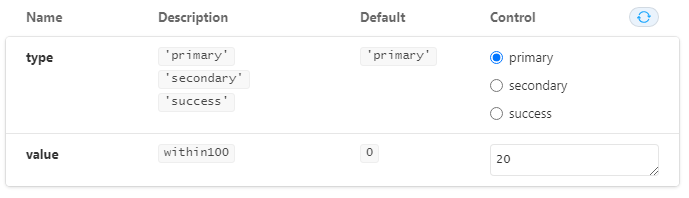
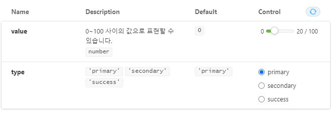

# ArgsTable 작성하기

[argsTable 관련 Storybook 가이드](https://storybook.js.org/docs/react/writing-docs/doc-blocks#argstable, 'argtable')

[읽어보면 도움되는 문서(gitHub)](https://github.com/storybookjs/storybook/tree/next/addons/controls, 'github controls')

propTypes 로 선언된 부분이나 React component의 prop를 이용해서 argsTable은 자동으로 작성됩니다.  
하지만 Storybook이 자동으로 작성한 화면의 내용이 충분하지 못한 경우 개발자나 퍼블리셔가 코드를 추가해서 사용자의 이해를 도울 수 있습니다.

변경가능한 항목들은 아래와 같습니다.

| Field                      | Description                                                                                             | 비고                                                                                                   |
| -------------------------- | ------------------------------------------------------------------------------------------------------- | ------------------------------------------------------------------------------------------------------ |
| name                       | The name of the property                                                                                |                                                                                                        |
| type.required              | The stories to be show, ordered by supplied name                                                        | props의 필수여부를 표시할 수 있습니다                                                                  |
| description                | A Markdown description for the property                                                                 | Description 열에 사용자가 원하는 내용(설명)을 추가할 수 있습니다                                       |
| table.type.summary         | A short version of the type                                                                             | Description 열에서 회색음영으로 강조되어 표시되는 부분입니다                                           |
| table.type.detail          | A long version of the type                                                                              | Description table.type.summary 로 작성된 부분을 클릭하면 상세정보를 표시할 수 있게끔 링크가 추가됩니다 |
| table.defaultValue.summary | A short version of the default value                                                                    |                                                                                                        |
| table.defaultValue.detail  | A long version of the default value                                                                     |                                                                                                        |
| control                    | [See addon-controls README(gitHub)](https://github.com/storybookjs/storybook/tree/next/addons/controls) |                                                                                                        |

# ArgsTable 작성예시, control 작성을 중심으로

예시(아래) value 값은 within100 이라는 함수를 이용해서 제한되고 있습니다.  
이 경우에는 story의 argsTable을 수정하면 사용자에게 친숙한 화면을 만들 수 있습니다.

컴포넌트의 propTypes 설정이 아래와 같다고 가정해봅시다.

```javaScript
LinearProgress.propTypes = {
    type: PropTypes.oneOf(['primary', 'secondary', 'success']),
    value: within100,
};
```

## 옵션을 작성하기 전

아래의 코드는 별도의 추가 설정을 하지 않은 story 입니다.

```javaScript
export default {
    title: 'Component/Progress/LinearProgress',
    component: LinearProgress,
};
```

이 경우에는 value의 description에는 within100 이라는 함수명만 보여지고 있는 것을 확인할 수 있습니다.  
LinearProgress의 propTypes에 정의된 내용을 그대로 옮겨와 자동으로 생성된 결과입니다.



## 옵션을 작성한 후

value의 값에 대한 설명과 control을 0~100 사이 값을 조정할 수 있는 slide-bar로 변경했습니다.

```javaScript
export default {
    title: 'Component/Progress/LinearProgress',
    component: LinearProgress,
    argTypes: {
        value: {
            description: '0~100 사이의 값으로 표현할 수 있습니다.',
            control: {
                type: 'range',
                min: 0,
                max: 100,
            },
            table: {
                type: {
                    summary: 'number',
                },
            },
        },
    },
};
```


